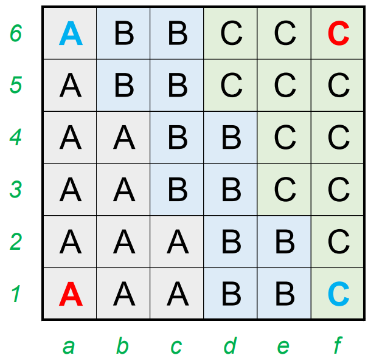
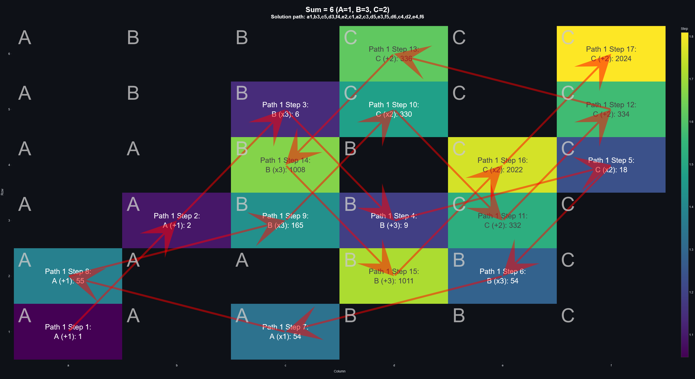
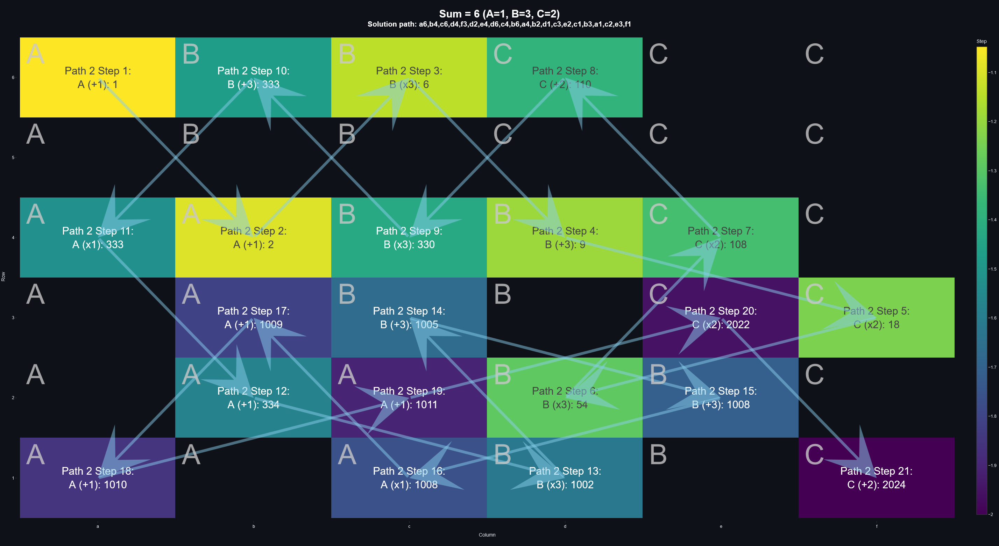

# Jane Street Puzzle - Knight Moves 6

This repo is my solution to Jane Street's [October 2024 puzzle](https://www.janestreet.com/puzzles/archive/).

N.B.: The commits were pushed to GitHub only after the competition had concluded.

## Question Formulation

> Pick **distinct positive integers** _A_, _B_, and _C_, and place them in the grid above.
> Your goal is to create two corner-to-corner trips — one from _a1_ to _f6_, and the other from _a6_ to _f1_ — both of which score **exactly 2024 points**.
>
> A “trip” consists of knight’s moves.
> Squares may **not** be revisited within a trip.
>
> The “score” for a trip is calculated as follows:
>
> - Start with _A_ points.
> - Every time you make a move:
>   -  if your move is between two _different_ integers, **multiply** your score by the value you are moving to;
>   - otherwise, **increment** your score by the value you are moving to.
>
> Can you find positive integers _A_, _B_, and _C_, as well as a pair of trips, that satisfy the criteria above?
> How low can you get _A + B + C_?
>
> Please format your entry by concatenating your values for _A_, _B_, and _C_, followed by your _a1_-to-_f6_ tour, followed by your _a6_-to-_f1_ tour.
> For example, “1,2,253,a1,b3,c5,d3,f4,d5,f6,a6,c5,a4,b2,c4,d2,f1” would be a properly formatted entry.
>
> To qualify for the leaderboard your value for _A + B + C_ must be **less than 50**.

## Thought process

- 2024 has prime factors 2x2x2x11x23.
  - Say there is a 4-step path (there probably isn't).
    Then with two A=4, one B=11, one C=23, we already have a solution < 50.
  - Or we can break down these numbers into smaller increment (e.g. A=1, with 8 initial steps within A) to accommodate more steps.
- The coordinate of each cell doesn't matter too much.
  What matters is the actual operations being carried out.
  - For example, in the sample solution, the first path `"a1,b3,c5,d3,f4,d5,f6"` would give the expression `f"(({A}+{A})*{B}+{B})*{C}+{C}+{C}"`.
  - In practice, this optimization roughly cuts the number of required iterations by half.
    - <s>But I am too lazy to implement the mapping once I found _one_ solution.</s>
- A less civil but robust method is naturally to iterate through all possibilities, which is the purpose of this repository.
  - I first generate all permutations of _A_, _B_, _C_ that sums to less than 50.
  There are 17832 of these.
  - I then search for all possible paths a knight can move corner-to-corner, and cache them in a database.
    - There are likely over a billion such paths possible.
      Betting that there will be multiple solutions, I stopped the generation at 40M paths.
    - For each path, a corresponding series of operations are stored as an f-string.
  - Then loop over all _A_, _B_, _C_, starting from the lowest sum, and identify paths that evaluate to 2024.
  - Finally, select any two paths, one starting from _a1_ and one from _a6_, that has the same combinations of _A_, _B_, _C_.
- The whole thing took around two and a half days.
- As an afterthought, if I had realized the sample space of potential knight moves and that multiple optimal solutions exist, I would have ditched the idea of caching all possible knight moves and already interrupt the calculation when the first solution is encountered. But hindsight is 20/20.

## Set up

- Create virtual environment once: `python -m venv $env:HomeDrive$env:HomePath\venvs\jane-street`
- Activate virtual environment in PowerShell: `& "$env:HomeDrive$env:HomePath\venvs\jane-street\Scripts\Activate.ps1"`
- `pip install -e .`
- Navigate to `./src/knight_moves_6/solver`.
- Note that all calculations are store in `./knight-moves-6.db`.
- Generate all permutations of ABC using `generate_abc.py`.
- Generate ~20M knight paths using `generate_paths_a1.py` and `generate_paths_a6.py`. (Reserve 22GB of storage.)
- Run `solver.py` to generate candidate pairs of _A_, _B_, _C_ values and knight paths that has a score of 2024.
  - Stop iteration once you are satisfied with your solution.
- Check your solution using `is_valid_solution()` in `knight_moves_6.calculation.validation`.
- (Manually) insert solutions to the Solution table using `write_solution()` in `knight_moves_6.model.database`.
- Run the dashboard `streamlit run app.py` to inspect your top 3 solutions.

### TODO (that I won't do now that the puzzle is solved)

- [ ] Centralize database operations in `knight_moves_6.model.operations.py`. Right now it is all over the place in `knight_moves_6.solver`.
- [ ] Insert valid solutions automatically. This is not implemented because we only need to submit one solution.
- [ ] Fix Plotly display scaling.

## Solution

There are MANY optimal solutions!

Below is one of them:

`1,3,2,a1,b3,c5,d3,f4,e2,c1,a2,c3,d5,e3,f5,d6,c4,d2,e4,f6,a6,b4,c6,d4,f3,d2,e4,d6,c4,b6,a4,b2,d1,c3,e2,c1,b3,a1,c2,e3,f1`

